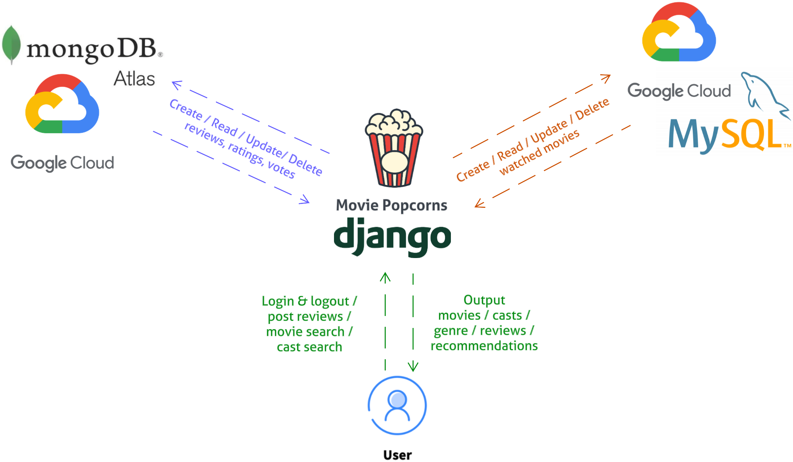

# Movie Popcorns 🍿

## Team Members
- Ang Zhen Cai (2201290)
- Colin Ng Kar Jun (2200920)
- Jeffrey Yap Wan Lin (2201018)
- Lee Yi Qing (2201087) 
- Muhammad Nur Dinie Bin Aziz (2200936)

## List of Contents
- [Introduction](#introduction)
- [Objectives](#objectives)
- [System Architecture Design](#system-architecture-design)
- [ER Diagram](#entity-relationship-diagram)
- [Relational Database](#relational-database) 
- [Non-Relational Database](#non-relational-database) 
- [Application Features](#application-features) 
- [Requirements](#requirements)
- [Installation](#installation)

## Introduction
---
Countless movies get released annually and a variety of popular actors are trending every other movie release. This makes it hard to stay updated of the movies and casts whether they acted in a recent or similar movie. Furthermore, movie database websites and applications unintentionally cause users to spend time browsing through lists of movies with basic filters like alphabetic and trending. As a result, users are often presented with clutter of irrelevant content and movies that are not up to their preferences. 

## Objectives
---
Movie Popcorns is aimed at retrieving information about a movie and its cast with the goal of linking other highly rated movies produced related to them. It is also aimed to be a hybrid application that optimizes both relational and non-relational databases with a Graphical User Interface (GUI) for user interactions on the frontend while a database management system (DBMS) efficiently operates the logic on the backend. Movie Popcorns showcases the practical implementation of using a multi-database management system for real world use on big datasets whilst also potentially enhancing the movie search process for passionate movie enthusiasts, making it more efficient and convenient to find titles for binge-watching. 

## System Architecture Design
---

Movie Popcorns follows a robust 3-tier architecture design, ensuring scalability, efficiency, and data integrity. The architecture consists of the following layers:
- Data Layer
  - The Data layer is in charge of ensuring data integrity and scalability throughout the databases. This layer is the gateway to accessing both of the relational and non-relational databases for storage and retrieval. The first database is a relational database which is MySQL that stores movie information and user account details. It stores structured and normalized dataset to ensure data consistency and integrity. The second database is a non-relational database which is MongoDB. It stores datasets such as movie details, reviews and miscellaneous detail since the data is constantly updating at unknown sizes and lengths. This will be used in conjunction with a relational database system, where it is more flexible in scaling horizontally.

- Application Layer
  - The Application layer which will be responsible for processing user requests and interacting with the database. It handles the movie, cast and review data processing, validation and constraints. In doing so, Movie Popcorns is able to support movies and casts filtering much more efficiently. This means that users are able to interact with the application in many ways that will translate to database queries easier.  

- Presentation Layer
  - The Presentation layer functions as a responsive GUI for users to interact with the program to provide real-time data retrieval, insertion, modification and deletion. Movie Popcorns utilizes Django as it is a user-friendly, straightforward and easy to use web framework. It is also coded in Python which makes MySQL and MongoDB queries much more hassle-free.

## Entity Relationship Diagram
---


## Relational Database 
---
MySQL was used as the relational database as it is widely adopted and has vast community support. The SQL syntax is also intuitive and easy to understand making it user-friendly and easy to use. Additionally, Django uses Python language and this supports MySQL libraries which we can take advantage of. Hence, various Python scripts were created to manipulate the given dataset into building the database that we envisioned.

## Non-Relational Database 
---
MongoDB was used as it is a Document-Type database which can scale up seamlessly and requires minimal administration. The Document-Type database benefits Movie Popcorns as compared to other non-relational database types. For instance, in comparison to a Key-Value database, MongoDB is more flexible for frequent updates and more suitable for complex queries as it is not fixed to a key. Furthermore, searching for documents can be done in multiple ways than just a single key. Speaking of which, MongoDB has library support in Python which makes database operations less of a problem.

## Application Features 
---
1. **Movie Posters and Trailers**<br>
Movie Popcorns thrives as a visually immersive application with the database storing crucial data like image and video sources. This application showcases a vast collection of posters and trailers, inviting users to engage actively with the content. Notably, each trailer is autoplayed offering users a seamless way to explore and discover more about the movies that pique their interest. This approach not only enriches the user experience but also encourages them to delve deeper into the cinematic world, making Movie Popcorns a captivating hub for movie enthusiasts.

2. **Movie Recommendations**<br>
Exclusive features for users that have an existing account, it analyzes and generates personalized movie recommendations based on user’s past reviews based on genre to cater to the user preferences. 

3. **Casts Filtering**<br>
Movie Popcorns enables users to search for movies of a specific cast but it also supports searching with a set of casts altogether. For instance, instead of searching “Robert Downey Jr.”, users may also add “Tom Holland, Zendaya” to the search string and this will filter out movies where all the 3 casts starred together.

4. **Autocomplete Search Boxes**<br>
Movie Popcorns goes above and beyond in aiding movie enthusiasts with its autocomplete search boxes. The search boxes adeptly seek out the closest matching value to the user's input, resulting in a precise discovery of their desired movie. The primary aim behind this feature is to assist users in locating films they vaguely remember but could not quite recall the full details of. With this thoughtful approach, Movie Popcorns ensures an enhanced and user-friendly movie searching experience like never before.

## Requirements
---
```
cd movie
pip install -r requirements.txt
```

## Installation
---
# Windows
```
cd movie
python manage.py runserver 8080
```

# Mac
```
cd movie
python3 manage.py runserver 8080
```

# Website
```
localhost:8080
```

