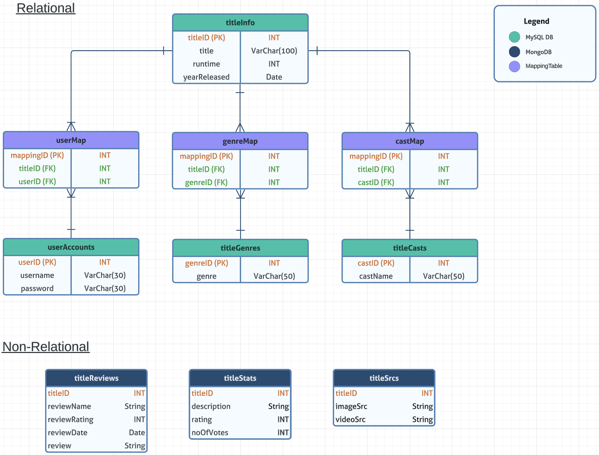

# Movie Popcorns 🍿

## Team Members
- Ang Zhen Cai (2201290)
- Colin Ng Kar Jun (2200920)
- Jeffrey Yap Wan Lin (2201018)
- Lee Yi Qing (2201087) 
- Muhammad Nur Dinie Bin Aziz (2200936)

## List of Contents
- [Introduction](#introduction)
- [Application Features](#application-features) 
- [System Architecture Design](#system-architecture-design)
- [Relational Database](#relational-database) 
- [Non-Relational Database](#non-relational-database) 
- [ER Diagram](#entity-relationship-diagram)
- [Requirements](#requirements)
- [Installation](#installation)


## Introduction
---
In the era of movies and entertainment, where there is a constant influx of new releases and a growing demand for personalized recommendations, Movie Popcorns aims to revolutionize the way movie enthusiasts discover and explore their favorite films. With a team of dedicated members passionate about cinema, we have developed an application that goes beyond basic movie information and delves into the interconnected world of movies, casts, and user reviews. Movie Popcorns is here to enhance the search process, provide comprehensive details, and offer a platform for users to engage and share their movie experiences.


## Application Features 
---
1. **Enhanced Movie Discovery**<br>
With a vast database of movies, users can efficiently browse and filter films based on various criteria such as genre, rating, and cast. This saves time and ensures that users can find movies that match their preferences with ease.

2. **User Engagement and Interaction**<br>
Movie Popcorns encourages user engagement by allowing users to post reviews and ratings, sharing their unique perspectives on movies. Additionally, users can create their own individual movie collections, fostering a sense of community and interaction among movie enthusiasts.

3. **Interactive User Interface**<br>
Our application boasts a responsive graphical user interface (GUI) integrated with React, making it user-friendly and easy to navigate. Users can enjoy a seamless experience, with support for filters and advanced searching options to find their desired movies effortlessly.


## System Architecture Design
---
Movie Popcorns follows a robust 3-tier architecture design, ensuring scalability, efficiency, and data integrity. The architecture consists of the following layers:
- Presentation Layer
  - This layer comprises a responsive GUI that allows users to interact with the database in real-time. Users can retrieve, insert, and modify movie-related data seamlessly through an intuitive and visually appealing interface.

- Application Layer
  - The application layer handles all movie and cast data processing, including validation and appropriate constraints. It ensures the accuracy and consistency of data throughout the system, enhancing the overall user experience.

- Data Layer
  - The data layer is responsible for maintaining data integrity and scalability across the databases. We have chosen MySQL as the relational database to store structured movie data, guaranteeing consistency in column values and efficient query optimization. Additionally, MongoDB, a non-relational key-value database, is used for dynamic datasets such as reviews, ratings, and casts, offering flexibility and horizontal scalability.

The movie dataset selected provides us with structured data such as title, runtime, genre and release date. Hence, it will be incorporated into a relational database, providing consistency in column values and better query optimization than a flat-file system. 

Additionally, datasets such as reviews, ratings, and casts are constantly updating at unknown data sizes and length. Therefore, this will be used in conjunction with a non-relational key-value database system, where it is more flexible in scaling horizontally.


## Relational Database 
---
MySQL will be used as a relational database as it is widely adopted and has vast community support. The SQL syntax used is also intuitive and easy to understand making it user-friendly


## Non-Relational Database 
---
MongoDB will be used as a non-relational database as it can scale up seamlessly and require minimal administration. Despite having downsides such as transactional operations, authorization and access to data. The dataset to be used does not require such operations which make this best fit.


## Entity Relationship Diagram
---



## Requirements
---
```
pip install django
pip install mysql-connector-python
pip install mysqlclient
pip install -r requirements.txt
```


## Installation
---
# Windows
```
cd movie
python manage.py runserver 8080
```

# Mac
```
cd movie
python3 manage.py runserver 8080
```

# Website
```
localhost:8080
```

